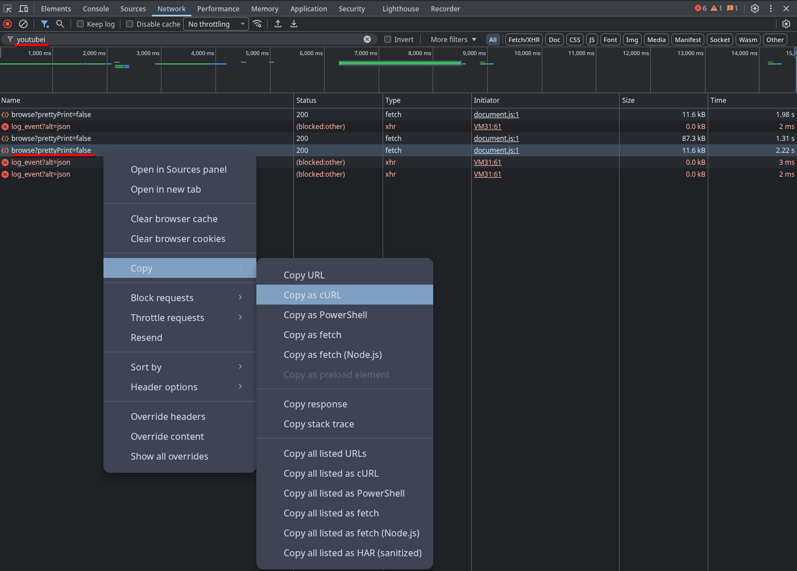

<h1 align="center">Spun — YouTube Music edition</h1>

<p align="center">A music player for Linux with CD, vinyl, cassette and recorder views —
this fork adds YouTube&nbsp;Music account sign‑in, library sync, direct streaming,
and a self‑contained AppImage.</p>

<p align="center">
  
</p>

<p align="center">
  <a href="#install">Install</a> ·
  <a href="#youtube-music-account">Add YouTube account</a> ·
  <a href="#build-the-appimage">Build the AppImage</a> ·
  <a href="#license">License</a>
</p>

> **This is a fork.** Spun is created by
> [**yappologistic**](https://github.com/yappologistic/Spun). This fork adds a better YouTube&nbsp;Music integration and an AppImage
> build. All credit for the original app goes to the upstream author; see
> [License](#license).

Play local music, connect to Jellyfin, Navidrome or Subsonic, control Apple Music
through Cider, or use **your own YouTube&nbsp;Music account**. Spun puts your album
artwork on a spinning CD, vinyl record, cassette or TP‑7‑inspired recorder, with an
interface inspired by Material Design 3. Optional 3D players add physical depth and
lighting that follows Noctalia's wallpaper palette.

**Source‑available · PolyForm Noncommercial 1.0.0.** Personal and other permitted
noncommercial use is free. This is not an OSI‑approved open‑source license.
[Read the details](#license).

## What this fork adds

- **Sign in to your YouTube Music account** from the **Account** tab and browse your
  own **liked songs, playlists, albums, artists and subscriptions** — not just the
  anonymous catalogue.
- **Write‑back:** **Like on YouTube Music** from a song's menu.
- **Direct streaming:** songs play by resolving a temporary audio URL and streaming
  it (with full‑track seeking, no download, no size limit), rather than buffering the
  file first.
- **A self‑contained AppImage** that bundles Qt (with the FFmpeg backend, so
  no system GStreamer is needed) and the entire YouTube runtime — a standalone
  Python with `ytmusicapi`/`yt‑dlp`, the `bgutil` PO‑token provider, Node and
  Deno. Native Wayland is included, with an XWayland/xcb fallback.

## Install

### AppImage (recommended)

Grab `Spun-x86_64.AppImage` from the [Releases](../../releases) page, then:

```bash
chmod +x Spun-x86_64.AppImage
./Spun-x86_64.AppImage
```

It bundles everything the YouTube features need; the only extra requirement is a
signed‑in web browser to authenticate with your account (see below). Running an
AppImage needs `libfuse2` on your system; if it is unavailable, run
`./Spun-x86_64.AppImage --appimage-extract-and-run`.

### Build from source

<details>
<summary><b>Arch / CachyOS</b></summary>

```bash
sudo pacman -S --needed base-devel git cmake ninja python qt6-base qt6-declarative qt6-multimedia qt6-svg qt6-wayland qt6-quick3d taglib
git clone https://github.com/Krivetochka/Spun-youtube-music.git
cd Spun-youtube-music
./scripts/build.sh -DBUILD_TESTING=OFF
./scripts/install-launcher.sh
```
</details>

<details>
<summary><b>Other distributions and Nix</b></summary>

You need a C++20 compiler, CMake 3.22+, Ninja, pkg‑config, Python 3, Qt 6.8+ (Quick
Controls, Multimedia, SVG; Quick 3D optional) and TagLib 2.0+. Package names differ
between distributions. The upstream README has per‑distro notes (Fedora, Ubuntu,
Nix) that apply here too — see
[yappologistic/Spun](https://github.com/yappologistic/Spun#install).

Add `-DSPUN_ENABLE_3D=OFF` to build without Quick 3D.
</details>

To use the YouTube features from a source build, install Python 3 (with venv/pip),
Node.js, Deno and git, then run once from the checkout:

```bash
./scripts/setup-youtube.sh
```

This creates an isolated runtime in `runtime/youtube` and builds the PO‑token
provider in `runtime/bgutil`. The AppImage bundles all of this already.

## YouTube Music account

### To use your account:

### Sign in

Copy the request headers from a signed‑in
`music.youtube.com` session once:

1. Open [music.youtube.com](https://music.youtube.com/), log in to your account.
2. Open your browser's developer tools → **Network** tab, and filter by `youtubei`.
3. Click around your **Library** so a **`browse`** request (status 200) appears.
4. Copy it — Firefox: **Copy Request Headers**; Chrome/Chromium: **Copy → Copy as
   cURL**. Spun accepts raw headers, cURL or "Copy as fetch"; the data must include
   `cookie` and `x-goog-authuser`.
5. In Spun: **Account → Sign in to YouTube Music…**, paste, confirm.

<p align="center">
  
  <br>
  <sub>Chrome/Chromium: right-click the <code>browse</code> request → <b>Copy → Copy as cURL</b>.</sub>
</p>

The session is stored only in `youtube/account.json` (owner‑readable) beside Spun's
settings. **Sign out** removes it; your local favourites, playlists and history are
kept. Cookies rotate over time, so occasionally you re‑paste to sign in again.

<details>
<summary><strong>Keyboard shortcuts</strong></summary>

| Action | Shortcut |
| --- | --- |
| Play / pause | Space |
| Previous / next track | Ctrl + Left / Right |
| Seek backward / forward | Left / Right |
| Add files / folder | Ctrl + O / Ctrl + Shift + O |
| Queue | Ctrl + L |
| Cider browser | Ctrl + B |
| Search the current panel | Ctrl + F |
| Quick jump | Ctrl + K |
| Mini mode | Ctrl + M |
| Immersive mode | Ctrl + I |
| Flip medium / switch lyrics | F / Y |
| Mute | M |
| Keyboard help | F1 |
| Back / dismiss | Escape |
| Quit | Ctrl + Q |

</details>

## Build the AppImage

Build it inside a clean **Ubuntu 22.04** environment:

```bash
distrobox create --name spun-build --image ubuntu:22.04
distrobox enter spun-build -- bash packaging/appimage/build.sh
```

The script installs its own build dependencies, fetches Qt with `aqtinstall`, builds
TagLib and Spun, assembles the bundled Python/Node/Deno/bgutil runtime, and packs the
image with `linuxdeploy` + `appimagetool`. Details and the exact list of what is and
is not bundled are in [`packaging/appimage/README.md`](packaging/appimage/README.md).

## License

Spun's original code and assets use the [PolyForm Noncommercial License 1.0.0](LICENSE), with [required notices and third-party credits](NOTICE).

The license permits noncommercial use, specified personal uses, modification and redistribution under its terms. It also permits use by certain charitable, educational, public research, public safety, health, environmental and government institutions, regardless of funding. It is broader than personal use only. Uses outside its permissions require a separate license from the relevant rights holder. The full license controls.

The author may offer separate commercial terms for code they own in the future. No paid edition is offered here.

Material Symbols Rounded icons retain their [Apache 2.0 license](licenses/MaterialSymbols-LICENSE.txt). Qt, TagLib and optional fonts retain their respective licenses. Spun is an independent project and is not endorsed by Google, Apple, Cider or Noctalia.
</content>
